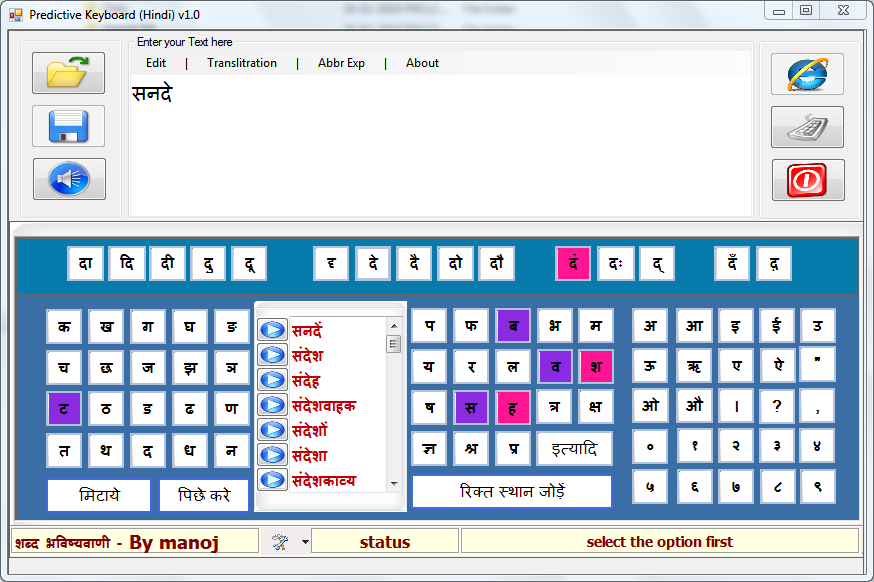

This repo contains word prediction in Indian language, Hindi in this case. The model is desktop version of original code which uses the webserive. The code provides error detection and correction in word prediction system for Hindi language. It also highlights the next character to be typed and guide the typing mechanism. It saves the many keypress to compose text directly in Unicode.

uncompress the 7zip at "PredictiveKeyboard\bin\Debug\File4ACM\data" place and then run the application
